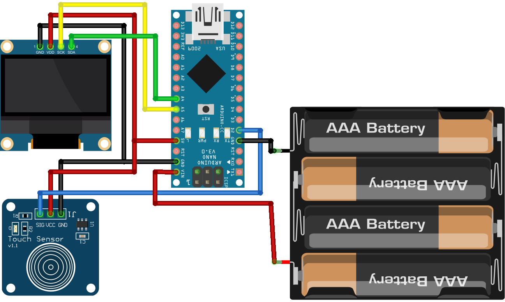

# Fakfak Bird ATMega328P-OLED

I’ve made this mini-project with the use of an Arduino Nano I had in my electronics’ box. Using an 128x64 monochromatic OLED and a capacitive touch sensor And yeah, it’s all fun and games.

## Wiring

The wiring is simple to do, as shown in the diagram below. I've used an I2C bus so that it won't be a pain to wire up and solder a 7-pin monochromatic OLED display.

Disclaimer: I used [Fritzing](https://fritzing.org/) to create the diagram below.

## Demo

[Here](./res/fakfak_bird_demo.mp4)'s an actual demo of the project. Below is the actual prototype demo I've made.

The monochromatic OLED display flickers due to the limitations of the camera I used.

## Running the Project

If you’re familiar with Visual Studio Code already, you must have the PlatformIO extension installed. If so, then you can simply open the repository folder from the PlatformIO workbench and click the upload button below the Visual Studio Code on the lower left of the status bar.
